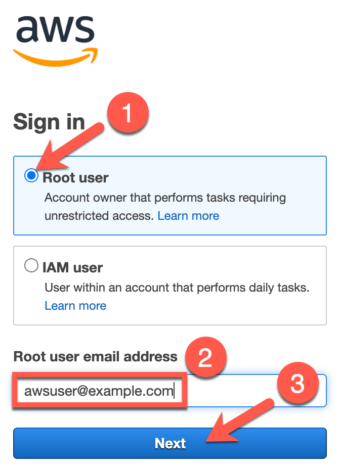
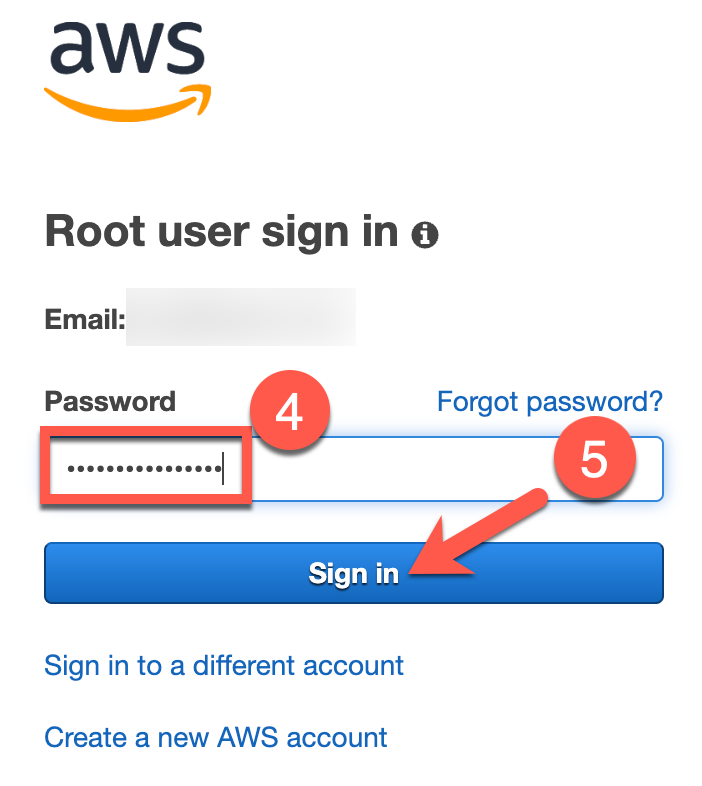
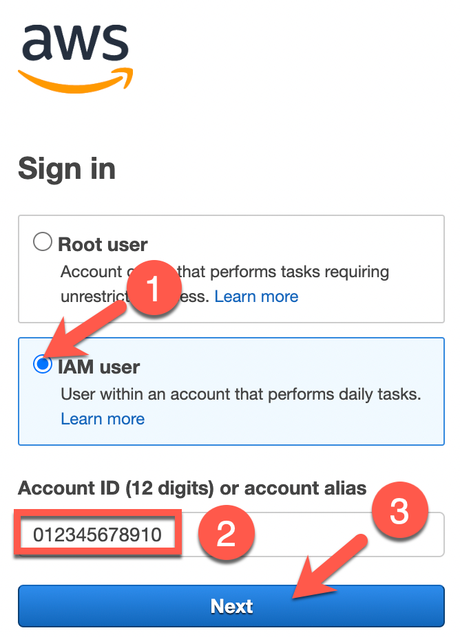
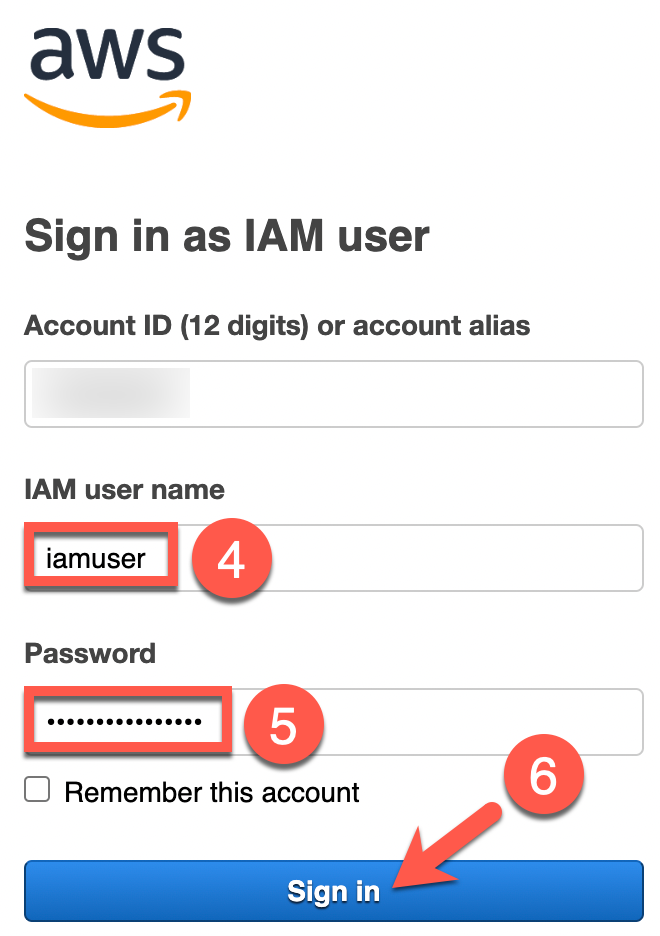
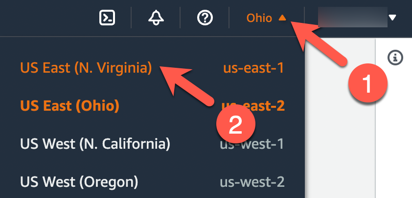
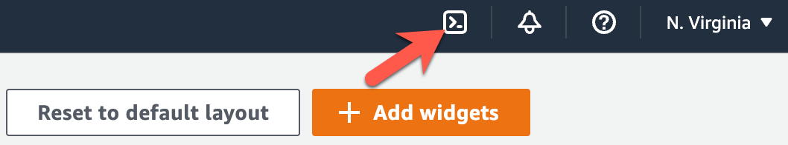
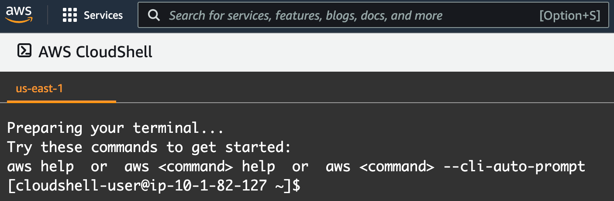

# Exercise 1: The Big Mistake

<!-- markdownlint-disable MD007 MD033-->

<!--Overriding style-->
<style>
  :root {
    --sans-primary-color: #ff0000;
}
</style>

**Estimated time to complete:** 20 minutes

## Objectives

- Deploy a CloudFormation stack from **AWS CloudShell** using `build.sh` which creates a public S3 bucket and uploads a sensitive file
- Audit cloud account using `s3audit` showing all of the storage issues
- Show that the file can freely be downloaded from anywhere

## Challenges

### Challenge 1: Launch AWS CloudShell and Download Workshop Code

The exercises performed in this workshop are designed to simply use your web browser - no additional tools (e.g., virtual machines, SSH clients) required! Many cloud vendors allow customers to generate a shell session in a vendor-managed container/VM to perform basic tasks. We will use this to our advantage to deploy resources, analyze their configurations, and fix those issues.

Begin by logging into your AWS account and launch a **CloudShell** session  in the **N. Virginia (us-east-1)** region.

Once in a **CloudShell** session, you will need to download [this code](https://github.com/bluemountaincyber/avoiding-data-disasters) in order to deploy resources via AWS CloudFormation. But how to pull the code down to the session? That's easy! AWS provides `git` in their **CloudShell** environment!

??? cmd "Solution"

    1. Navigate to [https://console.aws.amazon.com](https://console.aws.amazon.com) and sign in with either your root user account or an IAM user with **AdministratorAccess** permissions.

        !!! note "Root User"

            Select the **Root user** radio button (1), enter your email address used to sign up for AWS in the **Root user email address** text field (2), and click the **Next** button (3). On the next page, enter your password in the **Password** text field (4) and click the **Sign in** button (5).

            {: class="w300" }
            {: class="w300" }

        !!! note "IAM User"

            Select the **IAM user** radio button (1), enter your AWS account number of alias in the **Account ID (12 digits) or account alias** text field (2), and click the **Next** button (3). On the next page, enter your IAM username in the **IAM user name** text field (4), enter your IAM user's password in the **Password** text field (5), and click on the **Sign in** button (6).

            {: class="w300" }
            {: class="w300" }

    2. When you arrive at the **AWS Management Console**, ensure that you are currently interacting with the **N. Virginia (us-east-1)** region by taking a look at the top-right of the page. You should see **N. Virginia**. If you see a different region, click the down arrow next to the region's name (1) and select **East US (N. Virginia** (2).

        {: class="w400" }

    3. Now that you are interacting with the **N. Virginia (us-east-1)** region, click on the icon near the top-right that looks like a command prompt to start a **CloudShell** session.

        {: class="w500" }

    4. On the next page, you will see a banner that states *Waiting for environment to run...*. Wait a minute or two until you see a command prompt that looks similar to `[cloudshell-user@ip-10-1-82-127 ~]$` (your hostname will vary).

        {: class="w500" }

    !!! note

        Your **CloudShell** session will expire after roughly 20 minutes of inactivity. If this happens, simply attempt to type and the session should resume. If this does not work, refresh the page.

    5. Ensure that you are in your **CloudShell** session's home directory by running the following commands:

        ```bash
        cd /home/cloudshell-user
        pwd
        ```

        !!! summary "Expected Result"

            ```bash
            /home/cloudshell-user
            ```

    6. Use `git` to clone the **evidence-app** source code.

        ```bash
        git clone https://github.com/bluemountaincyber/avoiding-data-disasters
        ```

        !!! summary "Expected result"

            ```bash
            Cloning into 'avoiding-data-disasters'...
            remote: Enumerating objects: 96, done.
            remote: Counting objects: 100% (96/96), done.
            remote: Compressing objects: 100% (87/87), done.
            remote: Total 96 (delta 10), reused 94 (delta 8), pack-reused 0
            Receiving objects: 100% (96/96), 6.04 MiB | 17.19 MiB/s, done.
            Resolving deltas: 100% (10/10), done.
            ```

    7. Ensure that the code downloaded by running the following command:

        ```bash
        ls -la /home/cloudshell-user/avoiding-data-disasters/
        ```

        !!! summary "Expected Result"

            ```bash
            total 51
            drwxrwxr-x  5 cloudshell-user cloudshell-user 4096 Jun 16 13:14 .
            drwxr-xr-x 13 cloudshell-user cloudshell-user 4096 Jun 16 13:14 ..
            -rwxrwxr-x  1 cloudshell-user cloudshell-user 1424 Jun 16 13:14 build.sh
            -rw-rw-r--  1 cloudshell-user cloudshell-user 7171 Jun 16 13:14 customers.csv
            -rwxrwxr-x  1 cloudshell-user cloudshell-user  727 Jun 16 13:14 destroy.sh
            drwxrwxr-x  8 cloudshell-user cloudshell-user 4096 Jun 16 13:14 .git
            -rw-rw-r--  1 cloudshell-user cloudshell-user   40 Jun 16 13:14 .gitignore
            drwxrwxr-x  2 cloudshell-user cloudshell-user 4096 Jun 16 13:14 scripts
            -rw-rw-r--  1 cloudshell-user cloudshell-user 1062 Jun 16 13:14 TotallySecure.yaml
            drwxrwxr-x  3 cloudshell-user cloudshell-user 4096 Jun 16 13:14 workbook
            ```

### Challenge 2: Deploy Workshop IaC Resources

Finally, you have all of the components needed to deploy the resources in your AWS account.

Use `build.sh` to deploy the IaC (which can be found in the `avoiding-data-detections` directory). Ensure that all worked properly by searching for the following AWS resources using the AWS CLI (also provided in CloudShell):

- [ ] An S3 bucket with a name beginning with `sensitive-`
- [ ] An S3 object in that bucket called `customers.csv`

??? cmd "Solution"

    1. Run the `build.sh` script located in the `/home/cloudshell-user/avoiding-data-disasters/` directory. After roughly a minute, it should complete.

        ```bash

        /home/cloudshell-user/avoiding-data-disasters/build.sh
        ```

        !!! summary "Sample Result"

            ```bash
            Deploying CloudFormation stack... Done
            Setting bucket ACL... Done
            Uploading sensitive data... Done
            ```

    2. Now, check that the resources listed above were deployed properly.

        - S3 bucket beginning with the name `sensitive-`

            Here, we will use the AWS CLI with its `aws s3api list-buckets` command to gather information about our deployed buckets and then pass that information to the `jq` utility to parse the data and extract the bucket name beginning with the text `sensitive-`.

            ```bash
            aws s3api list-buckets | \
              jq -r '.Buckets[] | select(.Name | startswith("sensitive-")) | .Name'
            ```

            !!! summary "Sample result"

                ```bash
                sensitive-012345678910
                ```

        - S3 object called `customers.csv`

            And now, use a little Command Line Kung Fu to dig into the bucket beginning with `sensitive-` using the AWS CLI. This is a little more complex. First, we are setting the S3 bucket name to a variable to be used in the second command which will do two things: 1) list metadata about all objects in the bucket and 2) use `jq` to extract just the file name so we can verify that the file exists.

            ```bash
            BUCKET=$(aws s3api list-buckets | \
              jq -r '.Buckets[] | select(.Name | startswith("sensitive-")) | .Name')
            aws s3api list-objects --bucket $BUCKET | jq -r '.Contents[].Key'
            ```

            !!! summary "Sample result"

                ```bash
                customers.csv
                ```

### Challenge 3: Use s3audit to Audit S3 Configuration

Unfortunately, the `s3audit` tool is not available natively in AWS CloudShell, but that is easy to fix. Follow the installation instruction [here](https://github.com/scalefactory/s3audit-ts) and run the tool to assess your new S3 bucket.

??? cmd "Solution"

    1. There are two methods to install this tool: 1) download the appropriate release from GitHub or 2) use `npm` (which is included in AWS CloudShell) to install the `s3audit` package. We will go with option two as shown below:

        ```bash
        sudo npm install -g s3audit
        ```

        !!! summary "Sample result"

            ```bash
            npm WARN deprecated querystring@0.2.0: The querystring API is considered Legacy. new code should use the URLSearchParams API instead.

            added 179 packages, and audited 180 packages in 18s

            23 packages are looking for funding
            run `npm fund` for details

            found 0 vulnerabilities
            npm notice 
            npm notice New major version of npm available! 8.19.4 -> 9.7.1
            npm notice Changelog: https://github.com/npm/cli/releases/tag/v9.7.1
            npm notice Run npm install -g npm@9.7.1 to update!
            npm notice
            ```

    2. Using `s3audit` is as easy as just running `s3audit`. Since some folks may have more than one bucket in their AWS account, we can tell `s3audit` to look at a specific bucket using the `--bucket` flag. Run the command as follows to see the results of your security configuration for your `sensitive-*` bucket.

        ```bash
        s3audit --bucket=$BUCKET
        ```

        !!! summary "Sample result"

            ```bash
            (node:294) NOTE: We are formalizing our plans to enter AWS SDK for JavaScript (v2) into maintenance mode in 2023.

            Please migrate your code to use AWS SDK for JavaScript (v3).
            For more information, check the migration guide at https://a.co/7PzMCcy
            (Use `node --trace-warnings ...` to show where the warning was created)
            ❯ Checking 1 bucket
                ❯ sensitive-012345678910
                ❯ Bucket public access configuration
                    ✖ BlockPublicAcls is set to false
                    ✖ IgnorePublicAcls is set to false
                    ✖ BlockPublicPolicy is set to false
                    ✖ RestrictPublicBuckets is set to false
                ✔ Server side encryption is enabled
                ✖ Object versioning is not enabled
                ✖ MFA Delete is not enabled
                ✔ Static website hosting is disabled
                ✖ Bucket policy contains wildcard entities
                ✖ Bucket allows public access via ACL
                ✖ Logging is not enabled
                ✔ CloudFront Distributions
            ```

    3. **Oh no!** It appears that we have quite a bit of work to do to secure this bucket and its contents! Let's quickly verify that this is indeed bad. Remember, the name of the bucket begins with the word `sensitive`. Now, it is just a word, but let's pretend that this word means something... that the data in this bucket is **SENSITIVE**. By running the following command, you can see how easy this data is to access:

        ```bash
        echo "Go here: https://$BUCKET.s3.amazonaws.com/customers.csv"
        ```

        !!! summary "Sample result"

            ```bash
            Go here: https://sensitive-012345678910.s3.amazonaws.com/customers.csv
            ```

    4. Copy and paste the link that is displayed into a new browser tab. You may have noticed that the sensitive CSV file (`customers.csv`) was immediately downloaded without even asking for credentials. That is because the object is publicly accessible! That will be the first issue we fix.

## Conclusion

Now that you have the resources in place and realized just how bad this configuration is, let's start fixing this over the next few exercises.
