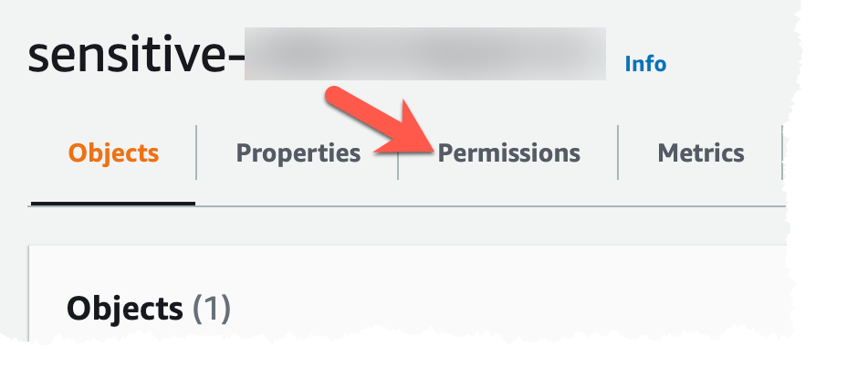
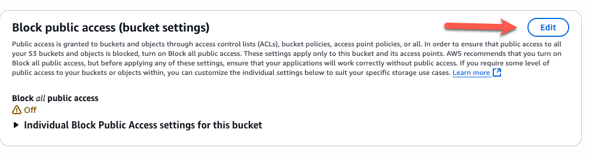
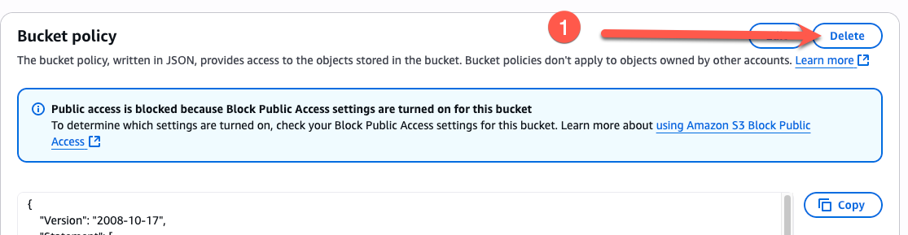
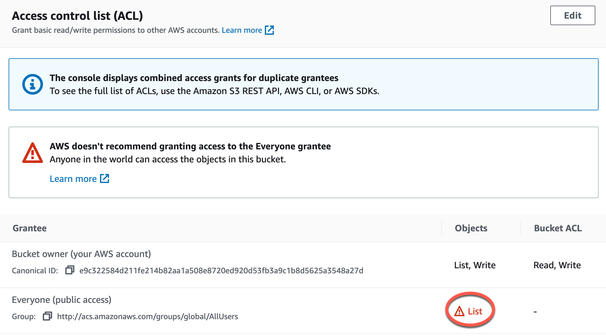
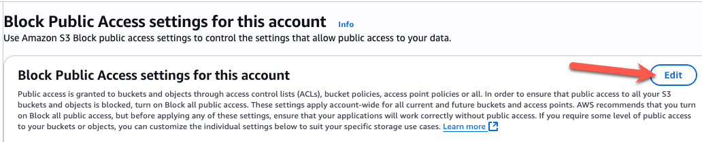

# Exercise 2: Shutting Down Public Access

<!-- markdownlint-disable MD007 MD033-->

<!--Overriding style-->
<style>
  :root {
    --sans-primary-color: #0000ff;
}
</style>

**Estimated Time to Complete:** 15 minutes

## Objectives

- Remove public access from the S3 bucket
- Prevent future buckets from becoming public across the entire account
- Attempt to change a bucket setting back to public

## Challenges

### Challenge 1: Remove Public Access From Bucket

In this first challenge, we need to fix the most critical issue: that our S3 objects are public-facing. But what is allowing this? Surely, this can't be a default configuration for AWS (and it's not). There are three things affecting this:

- The default **Block public access** settings are disabled
- There is a bucket policy attached to this bucket allowing any user to perform the `GetObject` API call against all object in the bucket
- There is an ACL configured for the bucket allowing **Everyone** to list and read from the bucket

Use either the AWS Management Console (as shown in the solution below) or the AWS CLI (if you want to use your CloudShell session)to disable or remove the above configuration issues.

??? cmd "Solution"

    1. In your web browser, you can navigate to AWS services a few different ways, but the easiest, if you know the name of the service, is to use the search bar at the top of the screen. Type `s3` in the search bar (1) and click on the **S3** result (2).

        {: class="w600" }

    2. On the next page, you should see your S3 bucket starting with the name `sensitive-`. Also note that, in the **Access** column, it lists this bucket as **Public** with a hazard sign next to it (1) - signifying that this may not be an appropriate configuration for this bucket (although this can be done purposefully if you want to share something publicly). Click on the name of the bucket (2) to edit its configuration.

        {: class="w600" }

    3. On the next page, there are a few different areas to access data and modify the bucket configuration (e.g., the Objects, Properties, and Permissions tabs). Since we are concerned with who can access data in this bucket, we will need to navigate to the **Permissions** tab.

        {: class="w300" }

    4. Under the **Permissions** tab, you will see all three of our configuration issues. The second pane contains our first issue: the **Block public access** settings are all disabled. Begin to enable all of them by clicking on the **Edit** button.

        {: class="w400" }

    5. On the next page, click the top checkbox next to **Block all public access** (this will enable all other checkboxes) (1) and click the **Save changes** button (2).

        {: class="w600" }

    6. You will receive a popup asking if you are sure that you want to make these changes. Type `confirm` in the text box and click the **Confirm** button.

        {: class="w400" }

    7. You should now be forwarded back to the **Permissions** tab. If you scroll down, you will find the next issue: the bucket policy. If you look closely, it would be allowing all principals (the entire internet) the ability to perform the `GetObject` API call against all objects in the bucket (essentially, downloading all data in the bucket). Now, this is over-ridden by the last change you made, but just in case that gets reset somehow, let's remove the policy as it is certainly not needed. This is as easy as clicking the **Delete** button under **Bucket Policy** (1), entering `` in the popup's text field (2), and clicking the **Delete** button in the popup (3).

        {: class="w600" }

        {: class="w400" }

    8. Now, if you scroll to the bottom of the **Permissions** tab, you should find the Access control list (ACL) settings. However, all looks well (i.e., no public settings). But wait, if you looked earlier before you made changes to the **Block public settings**, you would have seen this:

        {: class="w600" }

        So what happened? When you checked those **Block public access** settings, it removed the ACL for you!

    9. And now your data is no longer public-facing! You can verify this if you'd like by trying to download your data using the following URL (replace `BUCKET` with the name of your bucket):

        https://BUCKET.s3.amazonaws.com/customers.csv

        {: class="w600" }

### Challenge 2: Prevent Future Public Buckets

The previous configuration issues were not the hardest to fix, but if they were to occur again, we would have to discover them. Why not, instead, come up with a method to prevent these misconfigurations from happening in the first place?

Luckily, AWS provides an account-wide setting to prevent public S3 buckets which **is not** enabled by default. Find this setting and enforce it.

??? cmd "Solution"

    1. If you have been poking around the S3 bucket settings looking for a global setting that affects all buckets, you won't find it. It actually lives in the left pane and is intuitively called **Block Public Access settings for this account**. Click on this item.

        {: class="w250" }

    2. This will bring you to a very familiar configuration. Just as you did in challenge 1, begin to enable all of these settings by clicking on the **Edit** button.

        {: class="w400" }

    3. On the next page, click the top checkbox next to **Block all public access** (this will enable all other checkboxes) (1) and click the **Save changes** button (2).

        {: class="w600" }

    4. You will receive a popup asking if you are sure that you want to make these changes. Type `confirm` in the text box and click the **Confirm** button.

        {: class="w400" }

    5. Now you should no longer be able to create a public bucket. Let's test it!

### Challenge 3: Attempt to Configure Public Bucket

Attempt to undo some of the settings from challenge 1 to see if you are stopped.

??? cmd "Solution"

    1. We could attempt to set all of the settings back to their original form, but there is an easier way: destroy and rebuild the S3 bucket with CloudFormation. To do this, re-open your CloudShell session like you did in exercise 1 and run the following commands:

        First:

        ```bash
        /home/cloudshell-user/avoiding-data-disasters/destroy.sh
        ```

        !!! summary "Sample result"

            ```bash
            Emptying sensitive-206757820151 bucket... Done
            Destroying CloudFormation stack... Done
            ```

        Wait a few seconds, and run this command:

        ```bash
        /home/cloudshell-user/avoiding-data-disasters/build.sh
        ```

        !!! summary "Sample result"

            ```bash
            Deploying CloudFormation stack... FAILED
            ```

    2. It failed! That's what we want! We tried to break a rule and AWS wouldn't let us.

    3. There's another template that does not attempt to create a public bucket we can use that is part of another script: `build-nopublic.sh`. Run that command to deploy a private bucket. This should get us back to where we left off for the next few exercises.

        ```bash
        /home/cloudshell-user/avoiding-data-disasters/build-nopublic.sh
        ```

        !!! summary "Sample result"

            ```bash
            Deploying CloudFormation stack... Done
            Uploading sensitive data... Done
            ```

## Conclusion

In this exercise, you found just how it easy it is to remove public access but also how to prevent those incorrect settings from showing up in the future! We still have plenty of work to further protect this sensitive bucket.
