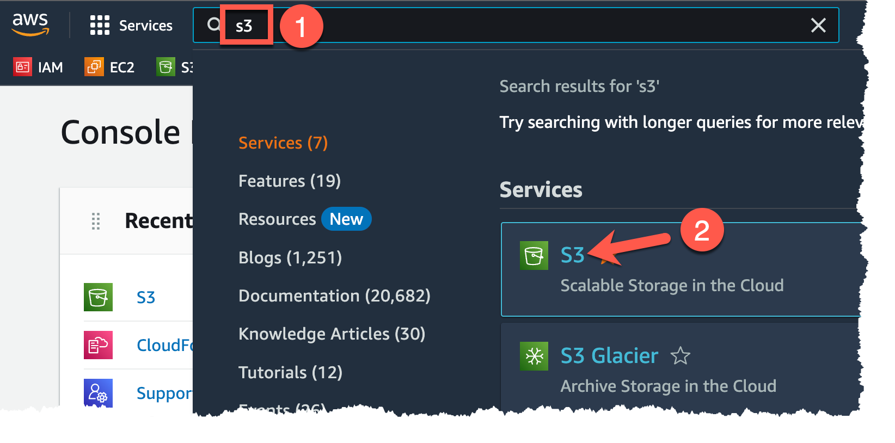
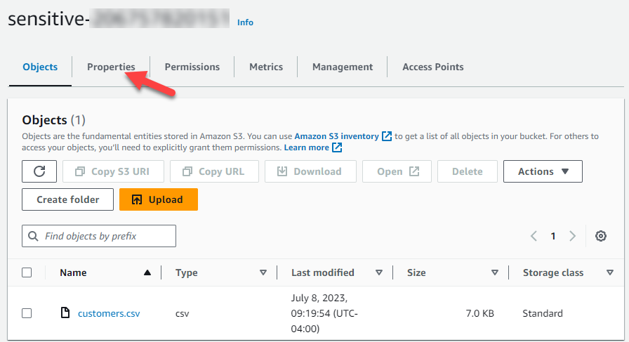
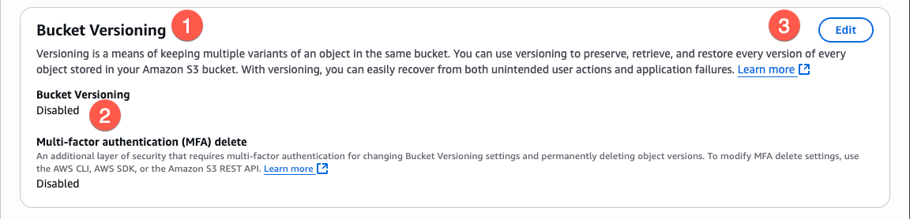

# Exercise 3: Attacking the Cloud Account

<!-- markdownlint-disable MD033-->

<!--Overriding style-->
<style>
  :root {
    --sans-primary-color: #0000ff;
}
</style>

**Estimated Time to Complete:** 15 minutes

## Objectives

- Turn on **Versioning** to prevent accidental modifications of this data
- Change the file
- Revert to the original version

## Challenges

### Challenge 1: Enable Bucket Versioning

There are a few different methods to ensure your data is backed up and recoverable in cloud storage solutions like versioning (which we'll leverage in this exercise), having the data automatically replicated to another bucket/storage account, and using third-party or custom tooling to replicate the data to another solution.

Enable **bucket versioning** on your S3 bucket beginning with `sensitive-` to ensure that, when an object is modified in any way, you can restore back to the original version (we will test this in the next two challenges).

??? cmd "Solution"

    1. Just as you began the previous exercise, use the search bar at the top of the screen to navigate to the S3 service by typing `s3` in the search bar (1) and clicking on the **S3** result (2).

        {: class="w600" }

    2. Once again, click on the bucket beginning with `sensitive-` to edit its configuration.

        {: class="w600" }

    3. When you arrive at the next page, instead of navigating to Permissions as you had before, bucket versioning settings can be found under the **Properties** tab. Click that tab to continue.

        {: class="w600" }

    4. Under Properties, you can find the **Bucket Versioning** section (1). Notice that **Bucket Versioning** is disabled (2) by default. Change this by clicking on the **Edit** button (3).

        {: class="w600" }

    5. Making the change to enable versioning is really simple: change the **Bucket Versioning** radio button to **Enable** (1) and click on **Save changes** (2).

        {: class="w600" }

    6. And now, let's put this to the test! 

### Challenge 2: Modify customers.csv File

Test that versioning is working by "accidentally" modifying our critical `customers.csv` file. Ensure that there are now two versions of the file - the original and the modified version.

??? cmd "Solution"

    1. The fastest way to do this is to head back to your **CloudShell** session.

        {: class="w600" }

    2. Create a new `customers.csv` file and place it in a temporary directory. Its contents can be anything you'd like, but you can use this as an example:

        ```bash
        echo 'SANS has the best cloud classes!' > /tmp/customers.csv
        echo -e "The content of /tmp/customers.csv is:\n\n$(cat /tmp/customers.csv)"
        ```

        !!! summary "Sample result"

            ```bash
            The content of /tmp/customers.csv is:

            SANS has the best cloud classes!
            ```

    3. Now, you can use the AWS CLI to replace the original `customers.csv` with this new one you just created like so:

        ```bash
        BUCKET=$(aws s3api list-buckets | \
              jq -r '.Buckets[] | select(.Name | startswith("sensitive-")) | .Name')
        aws s3 cp /tmp/customers.csv s3://$BUCKET/customers.csv
        ```

        !!! summary "Sample result"

            ```bash
            upload: ../../../tmp/customers.csv to s3://sensitive-012345678910/customers.csv
            ```

    4. You have two ways to see if versioning is working: using the Management Console (i.e., web browser) or, as we'll do since we're already here, use the CLI. The following command will show you version information about your `customers.csv` file.

        ```bash
        aws s3api list-object-versions --bucket $BUCKET
        ```

        !!! warning

            You may see a "page" of information at a time. To navigate through the results, you can use your arrow keys, space bar, and enter key to review the content. When finished, type `q` to exit this view.

        !!! summary "Sample result"

            ```bash
            {
                "Versions": [
                    {
                        "ETag": "\"76be91fb5343d39a88613ee5d3db9c30\"",
                        "Size": 33,
                        "StorageClass": "STANDARD",
                        "Key": "customers.csv",
                        "VersionId": "nCAKbMViAOx8Z49IiXVlBgZwHFXd1rM5",
                        "IsLatest": true,
                        "LastModified": "2023-07-08T13:41:03+00:00",
                        "Owner": {
                            "DisplayName": "ryan",
                            "ID": "e9c322584d211fe214b82aa1a508e8720ed920d53fb3a9c1b8d5625a3548a27d"
                        }
                    },
                    {
                        "ETag": "\"6d3c6b35840b98b7ca04ceb3a7438764\"",
                        "Size": 7171,
                        "StorageClass": "STANDARD",
                        "Key": "customers.csv",
                        "VersionId": "null",
                        "IsLatest": false,
                        "LastModified": "2023-07-08T13:19:54+00:00",
                        "Owner": {
                            "DisplayName": "ryan",
                            "ID": "e9c322584d211fe214b82aa1a508e8720ed920d53fb3a9c1b8d5625a3548a27d"
                        }
                    }
                ],
                "RequestCharged": null
            }
            ```

    5. That is a lot of information about just two versions of the same file (or as AWS puts it, `Key`). If you look closely, you will notice some significant differences between these two versions: the `LastModified` time, the `IsLatest` boolean value (one is `true` and one is `false`), and the `Size` to name a few.

    6. But which one would be downloaded if someone (or an applicaiton) is unaware of this change and just pulls the latest and greatest? Let's find out. Download the file by name only and save it to `/tmp/result.csv`.

        ```bash
        aws s3 cp s3://$BUCKET/customers.csv /tmp/result.csv
        ```

        !!! summary "Sample result"

            ```bash
            download: s3://sensitive-012345678910/customers.csv to ../../../tmp/result.csv
            ```

    7. Now, review its contents.

        ```bash
        cat /tmp/result.csv
        ```

        !!! summary "Sample result"

            ```bash
            SANS has the best cloud classes!
            ```

    8. It's the new `customers.csv` we created! Let's roll back this file to its original content next.

### Challenge 3: Revert Back to Original File

Roll the `customers.csv` file back to its original state and test that, when downloading that file by name, you get the correct version of the file.

??? cmd "Solution"

    1. This is as easy as removing the newest version of the file so there is only one version left (the original). Here, we will use the AWS Management Console. You may already be in the S3 service, but to ensure we're all at the same place, navigate to the S3 service by typing `s3` in the search bar (1) and clicking on the **S3** result (2).

        {: class="w600" }

    2. Once again, click on the bucket beginning with `sensitive-` to edit its configuration.

        {: class="w600" }

    3. To view or modify configurations of individual objects, click on the object (in our case, `customers.csv`).

        {: class="w600" }

    4. Notice at the top of the next page, there is a **Versions** tab, click on it to see all versions of this file.

        {: class="w600" }

    5. Here is where you will find the two different versions of the file. To remove the most recent (incorrect) version, place a check next to the top entry (it should contain **Current version** in the **Version ID**) (1) and click **Delete** (2).

        {: class="w600" }

    6. The next page, more or less, is asking if you're sure. We are, so type `permanently delete` in the text field (1) and click **Delete objects**.

        {: class="w600" }

    7. You can click **Close** on the next screen.

        {: class="w400" }

    8. And now, let's test this just like we did in the last challenge. Return to your CloudShell session and run the following commands:

        !!! note

            Notice here, we are using a trick so that we don't download this sensitive data to yet another system by writing to `stdout` (`-`) instead of a file.

        ```bash
        aws s3 cp s3://$BUCKET/customers.csv -
        ```

        !!! summary "Sample result"

            ```bash
            id,first_name,last_name,email,ip_address,cc_num
            1,Devonna,Misselbrook,dmisselbrook0@scientificamerican.com,244.90.204.78,3546634243157105
            2,Angie,Woolmer,awoolmer1@spiegel.de,215.80.41.15,4405492437748769

            <snip>

            98,Laure,Templeman,ltempleman2p@slideshare.net,218.83.151.153,3574682022422849
            99,Slade,O'Halloran,sohalloran2q@yolasite.com,138.163.159.16,5048370366368397
            100,Doralyn,Drydale,ddrydale2r@google.com,55.9.37.32,5305240410395993
            ```

## Conclusion

And now we have a method to restore data in the event that it is accidentally modified! If you have time, explore some other methods like [Bucket Replication](https://docs.aws.amazon.com/AmazonS3/latest/userguide/replication.html) which allows for availability in the event that the original bucket or region is unreachable.
