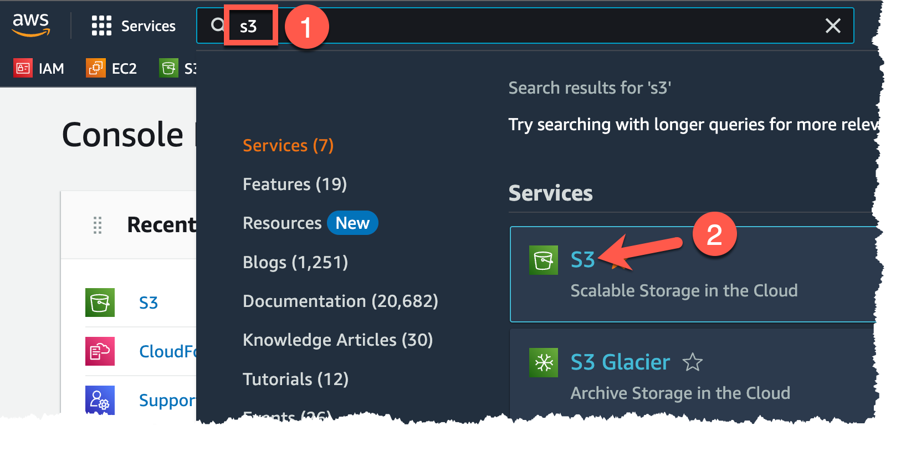
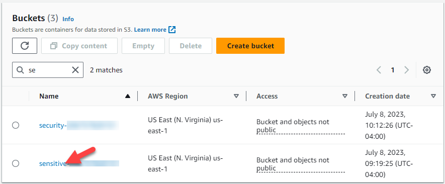
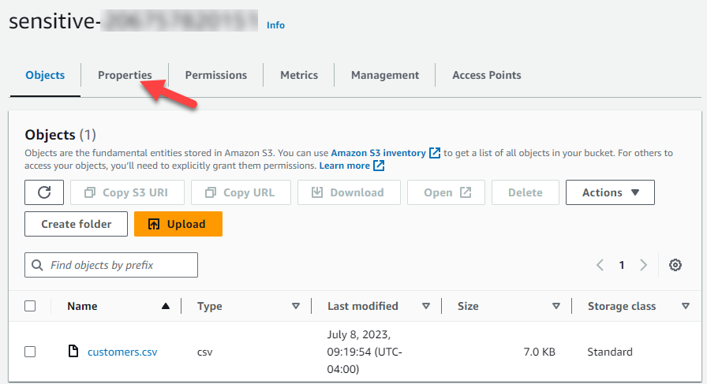
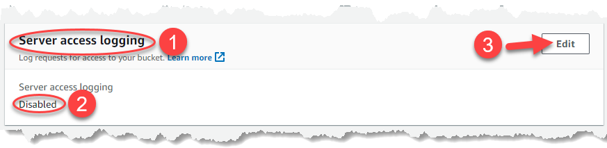
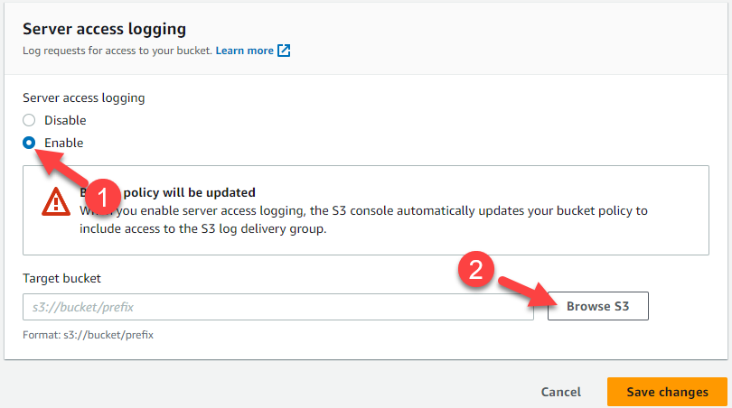
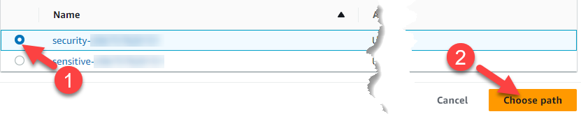
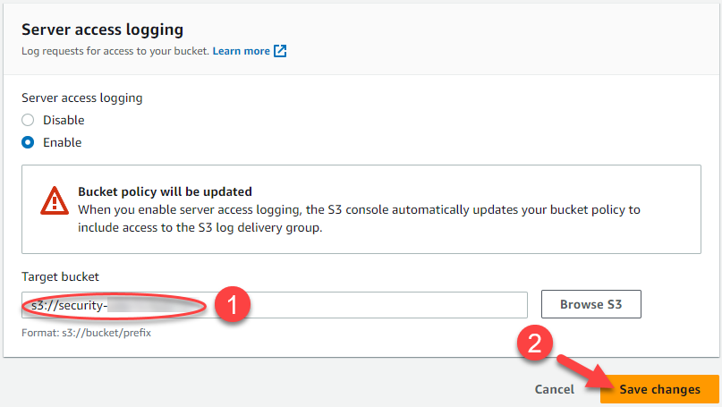

# Exercise 4: Monitoring

<!-- markdownlint-disable MD033-->

<!--Overriding style-->
<style>
  :root {
    --sans-primary-color: #0000ff;
}
</style>

**Estimated Time to Complete:** 15 minutes

!!! warning "Disclaimer"

    AWS S3 access logging is inconsistent in how quickly it starts logging once enabled. This exercise may or may not be successful for you, but at least we see how to enable logging.
    
    You can always revisit this exercise's challenges 2 and 3 once logging has been enabled for some time to have an experience more consistent with what is expected here.

## Objectives

- Turn on bucket access logging
- Access the file using the AWS CLI
- Review the access log data capturing this request

## Challenges

### Challenge 1: Turn On Bucket Access Logging

Since this `customers.csv` file and anything else that may end up in the `sensitive-` bucket is... *sensitive*, you will likely want to monitor any access to objects in this bucket. Create a new bucket to store log information called `security-` followed by your AWS account number and set up the `sensitive-` bucket to log access attempts to this new bucket.

??? cmd "Solution"

    1. The fastest way to create a new bucket is to head back to your **CloudShell** session.

        {: class="w600" }

    2. Grab your AWS account number and create a new bucket called `security-` followed by the account number.

        ```bash
        ACCTNUM=$(aws sts get-caller-identity --query 'Account' --output text)
        echo "The account number is: $ACCTNUM"
        aws s3api create-bucket --bucket security-$ACCTNUM
        ```

        !!! summary "Sample result"

            ```bash
            The account number is: 012345678910
            {
                "Location": "/security-012345678910"
            }
            ```

    3. Now, venture back to the AWS Management Console's S3 service as you had done previously. Navigate to the S3 service by typing `s3` in the search bar (1) and clicking on the **S3** result (2).

        {: class="w600" }

    4. You should now see **two** buckets: one beginning with `security-` and one beginning with `sensitive-`. Since we want to log interactions with the `sensitive-` objects, click on the bucket beginning with `sensitive-`.

        {: class="w600" }

    5. The access logging settings can be found under the **Properties** tab. Click on that tab to continue.

        {: class="w600" }

    6. If you scroll mid-way down the next page, you should find the **Server access logging** section (1) as well as its default setting of **Disabled** (2). To change this, click the **Edit** button (3).

        {: class="w600" }

    7. To begin enabling access logging, simply click the **Enable** radio button (1). You will be asked where to store the logs, so you can click **Browse S3** (2) to see the available options.

        !!! note

            Notice that AWS notifies you that it will update the receiving bucket's policy so that it can adequately receive the logging information.

        {: class="w600" }

    8. You should now see a list of available S3 buckets. **MAKE SURE TO CHOOSE THE ONE BEGINNING WITH `security-`!** (1) and then click **Choose path** (2).

        {: class="w600" }

    9. You should now see your bucket appear in the **Target bucket** field (1). Click **Save changes** (2) to enforce bucket logging.

        {: class="w600" }

### Challenge 2: Access the customers.csv File

To generate some log data, simply download the `customers.csv` file in your CloudShell session.

??? cmd "Solution"

    1. Head back to your **CloudShell** session.

        {: class="w600" }

    2. Just like in exercise 3, challenge 3, use some Command Line Kung Fu to access the `customers.csv` file content.

        ```bash
        BUCKET=$(aws s3api list-buckets | \
              jq -r '.Buckets[] | select(.Name | startswith("sensitive-")) | .Name')
        aws s3 cp s3://$BUCKET/customers.csv -
        ```

        !!! summary "Sample result"

            ```bash
            id,first_name,last_name,email,ip_address,cc_num
            1,Devonna,Misselbrook,dmisselbrook0@scientificamerican.com,244.90.204.78,3546634243157105
            2,Angie,Woolmer,awoolmer1@spiegel.de,215.80.41.15,4405492437748769

            <snip>

            98,Laure,Templeman,ltempleman2p@slideshare.net,218.83.151.153,3574682022422849
            99,Slade,O'Halloran,sohalloran2q@yolasite.com,138.163.159.16,5048370366368397
            100,Doralyn,Drydale,ddrydale2r@google.com,55.9.37.32,5305240410395993
            ```

    3. That was easy! Let's see if any log data shows our interaction.

### Challenge 3: Review the Access Log Data

Review the access log data in the bucket beginning with `security-`.

!!! note

    It may take 5-10 minutes until the data arrives in the bucket.

??? cmd "Solution"

    1. We will continue this work from the **CloudShell** session.

    2. First, let's see if the log data has arrived. Since we'll be referencing the `security-` bucket quite often, set an environment variable called `LOGBUCKET` which references this bucket name.

        ```bash
        LOGBUCKET=$(aws s3api list-buckets | \
              jq -r '.Buckets[] | select(.Name | startswith("security-")) | .Name')
        echo "The log bucket is: $LOGBUCKET"
        ```

        !!! summary "Sample result"

            ```bash
            The log bucket is: security-012345678910
            ```

    3. Now that we retrieved the bucket name, let's see if there is any data in there.

        !!! warning

            If there are no results, the data just did not arrive yet. In fact, AWS' [documentation](https://docs.aws.amazon.com/AmazonS3/latest/userguide/ServerLogs.html#LogDeliveryBestEffort) states that it could be up to hours IF AT ALL.

        ```bash
        aws s3 ls s3://$LOGBUCKET/
        ```

        !!! summary "Sample result"

            ```bash
            2023-07-08 15:11:09        558 2023-07-08-15-11-08-542B672B0A76BD48
            
            <snip>

            2023-07-08 15:20:07        656 2023-07-08-15-20-06-350AE97D7741A9F1
            ```

    4. To analyze this data, you can use the AWS CLI to output their contents to `/tmp/s3logs/` like so:

        ```bash
        mkdir /tmp/s3logs
        aws s3 cp --recursive s3://$LOGBUCKET/ /tmp/s3logs/
        ```

        !!! summary "Sample result"

            ```bash
            download: s3://security-012345678910/2023-07-08-15-12-11-7BD4A500BC707BB9 to ../../../tmp/s3logs/2023-07-08-15-12-11-7BD4A500BC707BB9
            
            <snip>

            download: s3://security-012345678910/2023-07-08-15-20-06-350AE97D7741A9F1 to ../../../tmp/s3logs/2023-07-08-15-20-06-350AE97D7741A9F1
            ```

    5. To view any records related to `customers.csv`, we can begin with a simple `grep` to show any of these files containing our sensitive file's name.

        ```bash
        grep customers.csv /tmp/s3logs/*
        ```

        !!! summary "Sample result"

            ```bash
            /tmp/s3logs/2023-07-08-15-35-59-69BCA2D0660A17B4:e9c322584d211fe214b82aa1a508e8720ed920d53fb3a9c1b8d5625a3548a27d sensitive-206757820151 [08/Jul/2023:14:27:40 +0000] 44.211.241.53 e9c322584d211fe214b82aa1a508e8720ed920d53fb3a9c1b8d5625a3548a27d N77G2TV3SB07S8KE REST.HEAD.OBJECT customers.csv "HEAD /customers.csv HTTP/1.1" 200 - - 7171 15 - "-" "aws-cli/2.12.5 Python/3.11.4 Linux/4.14.255-314-253.539.amzn2.x86_64 exec-env/CloudShell exe/x86_64.amzn.2 prompt/off command/s3.cp" - 06yjXKKPiFPCD9bJWc+vx64/ppK3UmX/RAYbMtA10kaUfZw1OQKu/bNhpBmpiEsKX/6pq7LOHKE= SigV4 ECDHE-RSA-AES128-GCM-SHA256 AuthHeader sensitive-206757820151.s3.us-east-1.amazonaws.com TLSv1.2 - -
            /tmp/s3logs/2023-07-08-15-35-59-69BCA2D0660A17B4:e9c322584d211fe214b82aa1a508e8720ed920d53fb3a9c1b8d5625a3548a27d sensitive-206757820151 [08/Jul/2023:14:27:40 +0000] 44.211.241.53 e9c322584d211fe214b82aa1a508e8720ed920d53fb3a9c1b8d5625a3548a27d N77ZMY7RVA115S35 REST.GET.OBJECT customers.csv "GET /customers.csv HTTP/1.1" 200 - 7171 7171 27 26 "-" "aws-cli/2.12.5 Python/3.11.4 Linux/4.14.255-314-253.539.amzn2.x86_64 exec-env/CloudShell exe/x86_64.amzn.2 prompt/off command/s3.cp" - t6Ecnw35IOOpvmffdz9iDHHOoG6zbt5YKbtxxfRIy/QqtjrJYqdlZZLHJrzRlmUkOEUBpV3ctBQ= SigV4 ECDHE-RSA-AES128-GCM-SHA256 AuthHeader sensitive-206757820151.s3.us-east-1.amazonaws.com TLSv1.2 - -
            ```

    6. Those are some **noisy** logs with an unknown (for now), space-delimited structure. To see the various elements of an S3 access log, it is documented [here](https://docs.aws.amazon.com/AmazonS3/latest/userguide/LogFormat.html).

    7. Let's cut to the chase and review some key information like:

        - What was the date/time of the access attempt? That is the 3rd and 4th space-delimited values (there is a space between the time and time zone offset)

        - Was it a change or just read access? You can gather this by looking at the REST API call used (8th space-delimited field)

        - Which IP address made the request? That is the 5th space-delimited field

        - Which tool was likely used to make the request (i.e., User-Agent string)? This one is tricky, but instead of counting space-delimited fields, we can look at double-quotes. If we were delimiting the content by double-quotes, we would find that the 6th field is the User-Agent string.

    8. Let's put all of that together to extract our data of interest. We'll even use a bit of command line magic to output this as JSON.

        ```bash
        IFS=$'\n'
        for LOG in $(grep customers.csv /tmp/s3logs/*); do
            echo -n '{'
            echo -n '"timestamp": "'
            printf $LOG | awk -F ' ' '{print $3" "$4}' | tr -d '\n'
            echo -n '",'
            echo -n '"sourceIpAddress": "'
            printf $LOG | awk -F ' ' '{print $5}' | tr -d '\n'
            echo -n '",'
            echo -n '"restMethod": "'
            printf $LOG | awk -F ' ' '{print $8}' | tr -d '\n'
            echo -n '",'
            echo -n '"userAgent": "'
            printf $LOG | awk -F '"' '{print $6}' | tr -d '\n'
            echo -n '"'
            echo '}'
        done | jq
        ```

        !!! summary "Sample result"

            ```bash
            {
                "timestamp": "[08/Jul/2023:14:27:40 +0000]",
                "sourceIpAddress": "44.211.241.53",
                "restMethod": "REST.HEAD.OBJECT",
                "userAgent": "aws-cli/2.12.5 Python/3.11.4 Linux/4.14.255-314-253.539.amzn2.x86_64 exec-env/CloudShell exe/x86_64.amzn.2 prompt/off command/s3.cp"
            }
            {
                "timestamp": "[08/Jul/2023:14:27:40 +0000]",
                "sourceIpAddress": "44.211.241.53",
                "restMethod": "REST.GET.OBJECT",
                "userAgent": "aws-cli/2.12.5 Python/3.11.4 Linux/4.14.255-314-253.539.amzn2.x86_64 exec-env/CloudShell exe/x86_64.amzn.2 prompt/off command/s3.cp"
            }
            ```

## Conclusion

If you were fortunate enough to have the logs appear quickly, congrats! If not, many cloud providers do require patience at times - especially when it comes ot logging. Now that we have logging at least set up for our more critical data, let's move onto our final major exercise: **Reviewing Our Work and Shifting Left**.
